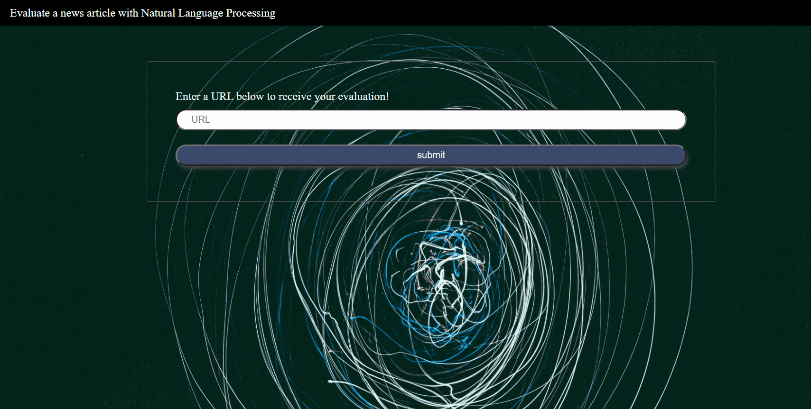

# Overview
This is a web app which runs Natural Language Processing on articles of your choice. This is achieved using Aylien API. This API will give you information such as polarity, subjectivity, polarity confidence & subjectivity confidence of the article. 

# Demo

# Getting Started
Clone, fork or download this repo.

# To run this app
* npm install
* npm run build-prod
* npm run start
* Then navigate to localhost:8081

# Dependencies
* HTML
* CSS
* Javascript
* Sass
* Babel
* Express (Node.js framework)
* Webpack
